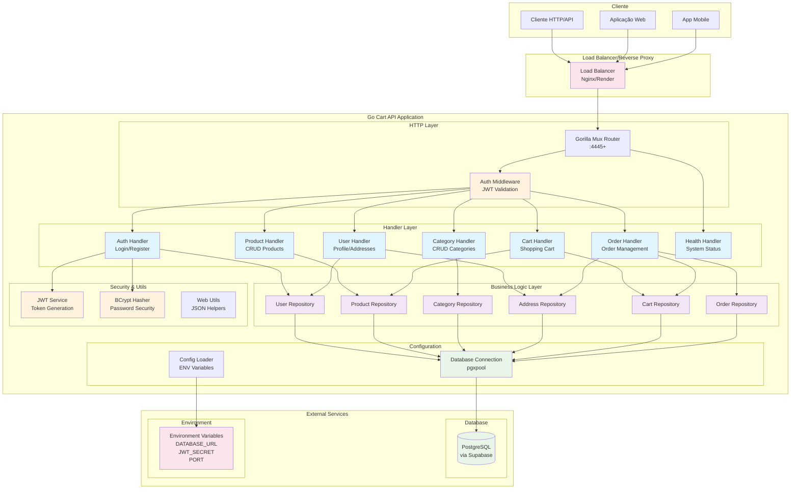
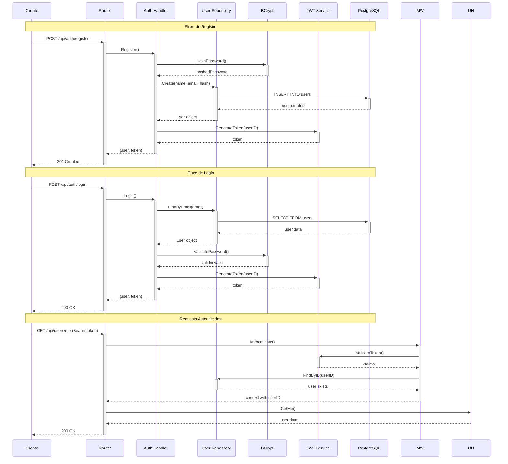
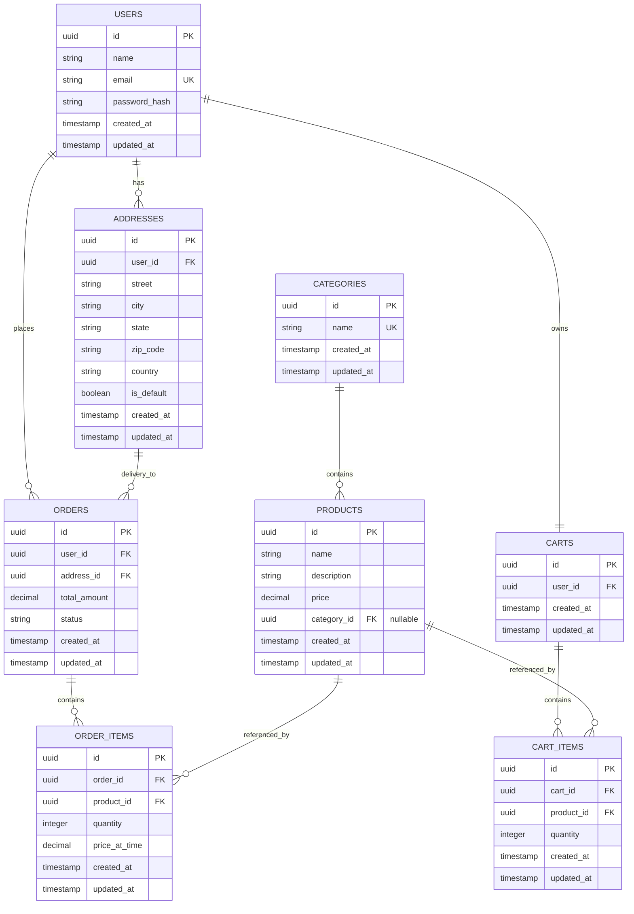
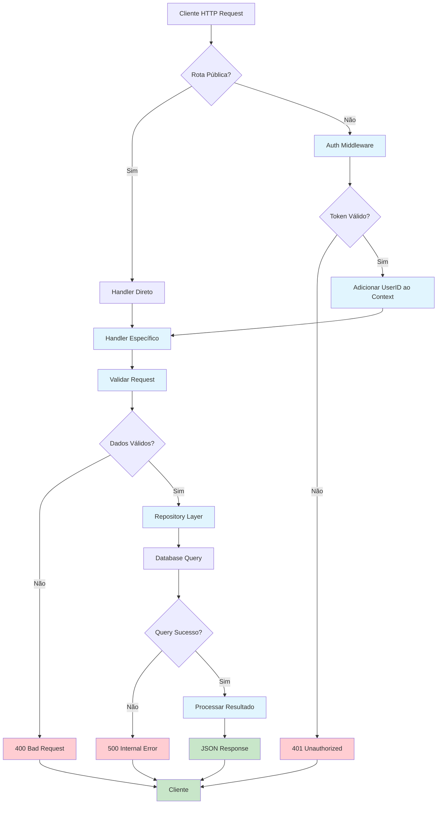
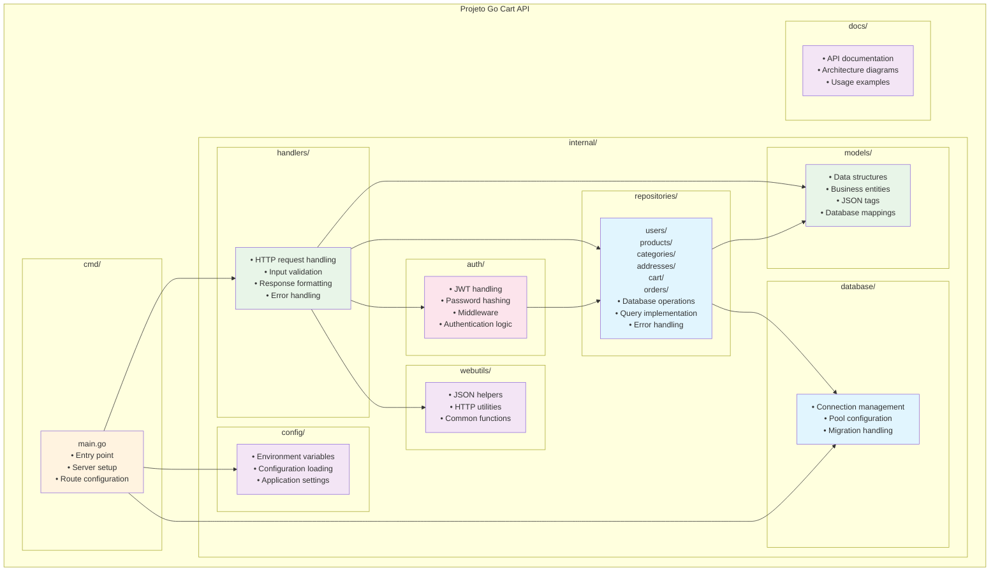

# Diagrama de Arquitetura - Go Cart API

Esta documentação apresenta os diagramas de arquitetura do sistema Go Cart API, uma API RESTful em Go para e-commerce.

## 1. Arquitetura Geral do Sistema

## 2. Fluxo de Autenticação

## 3. Modelo de Dados (ERD)

## 4. Fluxo de API Requests

## 5. Estrutura de Pastas e Responsabilidades

## 6. Tecnologias e Dependências

### Core Dependencies
- **Go 1.23+**: Linguagem principal
- **Gorilla Mux**: Roteamento HTTP
- **pgx/v5**: Driver PostgreSQL
- **UUID**: Identificadores únicos
- **JWT**: Autenticação baseada em tokens
- **bcrypt**: Hash de senhas

### External Services
- **PostgreSQL**: Banco de dados principal (via Supabase)
- **Render/Heroku**: Hospedagem da aplicação

### Environment Variables
- `DATABASE_URL`: Connection string do PostgreSQL
- `JWT_SECRET`: Chave secreta para tokens JWT
- `PORT`: Porta do servidor (auto-detectada se não definida)

## 7. Padrões Arquiteturais

### Clean Architecture
- **Separation of Concerns**: Cada camada tem responsabilidade específica
- **Dependency Inversion**: Repositories como interfaces, implementações injetadas
- **Independence**: Regras de negócio independentes de frameworks

### Repository Pattern
- Abstração do acesso a dados
- Interfaces para testabilidade
- Implementações específicas para PostgreSQL

### Middleware Pattern
- Autenticação centralizada
- Interceptação de requests
- Context enrichment

### RESTful API Design
- Recursos bem definidos
- Métodos HTTP semânticos
- Status codes apropriados
- JSON como formato padrão