# API Endpoints Overview - Go Cart API

## 🗺️ Mapa de Endpoints

```mermaid
graph LR
    subgraph "Rotas Públicas"
        A[GET /api/health]
        B[POST /api/auth/register]
        C[POST /api/auth/login]
        D[GET /api/products]
        E[GET /api/products/{id}]
        F[GET /api/categories]
        G[GET /api/categories/{id}]
    end
    
    subgraph "Rotas Protegidas 🔒"
        subgraph "Users"
            H[GET /api/users/me]
            I[GET /api/users/{id}/addresses]
            J[POST /api/users/{id}/addresses]
            K[PUT /api/users/{id}/addresses/{aid}]
            L[DELETE /api/users/{id}/addresses/{aid}]
            M[PATCH /api/users/{id}/addresses/{aid}/default]
        end
        
        subgraph "Products Management"
            N[POST /api/products]
            O[PUT /api/products/{id}]
            P[DELETE /api/products/{id}]
        end
        
        subgraph "Categories Management"
            Q[POST /api/categories]
            R[PUT /api/categories/{id}]
            S[DELETE /api/categories/{id}]
        end
        
        subgraph "Shopping Cart"
            T[GET /api/cart]
            U[POST /api/cart/items]
            V[PUT /api/cart/items/{pid}]
            W[DELETE /api/cart/items/{pid}]
            X[DELETE /api/cart]
        end
        
        subgraph "Orders"
            Y[POST /api/orders]
            Z[GET /api/orders]
            AA[GET /api/orders/{id}]
            BB[PATCH /api/orders/{id}/cancel]
        end
    end
    
    %% Styling
    classDef public fill:#c8e6c9
    classDef protected fill:#ffcdd2
    classDef management fill:#e1f5fe
    classDef commerce fill:#fff3e0
    
    class A,B,C,D,E,F,G public
    class H,I,J,K,L,M,N,O,P,Q,R,S protected
    class T,U,V,W,X,Y,Z,AA,BB commerce
```

## 🔄 Fluxo do E-commerce

```mermaid
graph TD
    A[👤 Usuário acessa sistema] --> B{Já registrado?}
    B -->|Não| C[📝 Registro - POST /api/auth/register]
    B -->|Sim| D[🔑 Login - POST /api/auth/login]
    
    C --> E[✅ Token JWT gerado]
    D --> E
    
    E --> F[🏪 Navegar produtos - GET /api/products]
    F --> G[🛒 Adicionar ao carrinho - POST /api/cart/items]
    
    G --> H{Continuar comprando?}
    H -->|Sim| F
    H -->|Não| I[📍 Verificar endereços - GET /api/users/me/addresses]
    
    I --> J{Tem endereço?}
    J -->|Não| K[➕ Adicionar endereço - POST /api/users/me/addresses]
    J -->|Sim| L[📋 Revisar carrinho - GET /api/cart]
    
    K --> L
    L --> M[💳 Criar pedido - POST /api/orders]
    M --> N[📦 Acompanhar pedidos - GET /api/orders]
    
    %% Styling
    classDef start fill:#c8e6c9
    classDef auth fill:#e1f5fe
    classDef shop fill:#fff3e0
    classDef order fill:#f3e5f5
    
    class A start
    class B,C,D,E auth
    class F,G,H shop
    class I,J,K,L,M,N order
```

